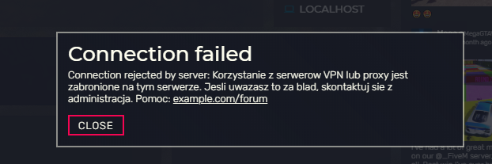

# OK! No.Proxy FiveM
Skrypt dla serwerów FiveM do obsługi [OK! No.Proxy](https://www.okaeri.eu/services/noproxy).

### Konfiguracja
Należy ustawić wartość `Token`, która znajduje się w pliku `config.lua` na swój token usługi (klucz prywany) z panelu Okaeri.

### Uprawnienia
|      Nazwa     |            Działanie            |
|:--------------:|:-------------------------------:|
| noproxy.bypass | Pozwala wejść na serwer z proxy |

### Zrzuty ekranu

